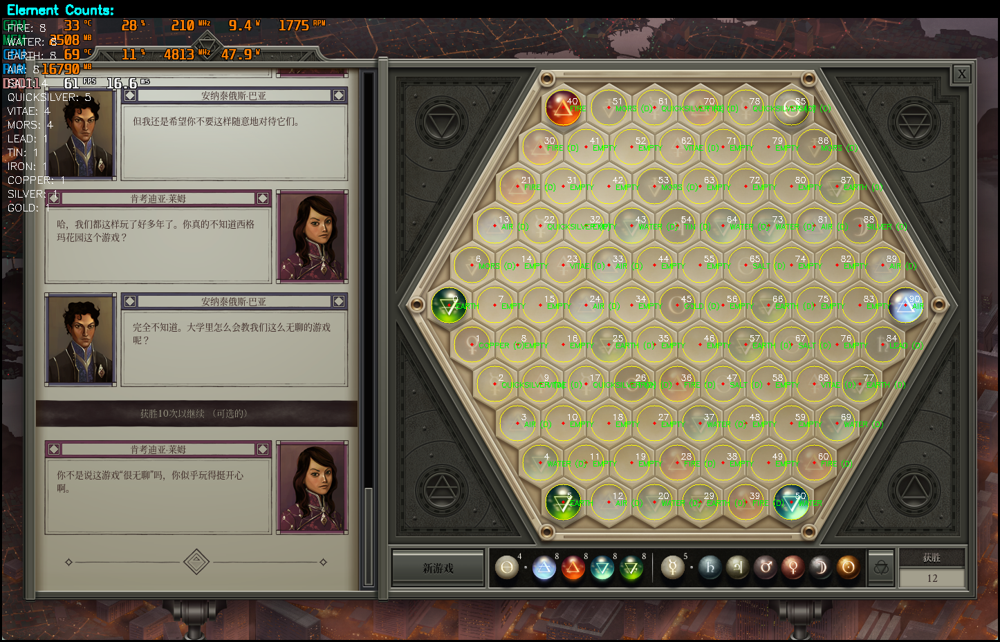
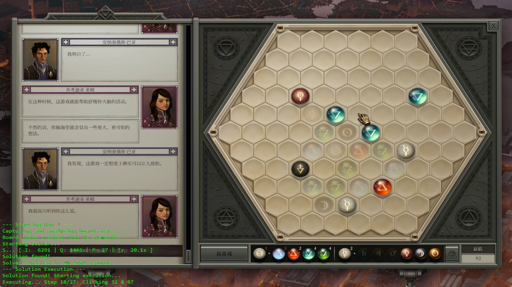

# Opus Magnum Bot

一个用于自动解决《Opus Magnum》谜题的 Python 脚本。

该工具通过屏幕捕捉分析游戏棋盘，使用 A* 算法寻找解法，并调用 win32api 模拟鼠标点击来执行操作。

## 元素识别 

### 求解过程
 
#### 样例输出

 `python -m src.solver` 的一次典型输出：

```bash
--- Running Full Solver Self-Test ---
Step 1: Initializing managers...
Window 'Opus Magnum' found with handle: 723190
Loading templates from 'assets/templates'...
Successfully loaded 67 templates.
Step 2: Capturing and analyzing board state...
Board state created.
Step 3: Starting solver...
S... [ I:    89 | Q:  135 | P: 27 | T:   0.3s ]
DEBUG: Solution found!

Solver finished in 0.2961 seconds.

--- Solver Results ---
Solution Found!
Sequence of moves (hex indices):
  Step 1: Remove hexes 12 and 78
  Step 2: Remove hexes 30 and 89
  ...
  Step 27: Remove hexes 55 and 56
```
### 执行操作



## 项目结构

```
.
├── assets/             # 模板图片
├── config/             # 配置文件
├── doc/                # 文档
├── src/                # 源代码
│   ├── element_detector.py # 元素识别
│   ├── grid_manager.py     # 网格管理
│   ├── input_manager.py    # 输入模拟
│   ├── overlay_manager.py  # 状态覆盖
│   ├── solver.py           # 解谜器
│   └── window_manager.py   # 窗口管理
├── tools/              # 工具脚本
├── main.py             # 主入口
└── requirements.txt    # 依赖
```

## 使用说明

详细的安装和使用方法，见 [快速上手指南](doc/QUICKSTART.md)。

项目参数的配置方法和模板获取方式，见 [用户手册](doc/USER_GUIDE.md)


关于启发式函数调参信息等，见 [附录](doc/APPENDIX.md)。

## 待实现功能

- [ ] **完善h函数参数讨论**: 目前的启发式函数参数是基于经验得出的，未来可以进行量化讨论。
- [ ] **支持西格玛花园2**: 适配西格玛花园2，增加对“以太”的识别和求解逻辑。