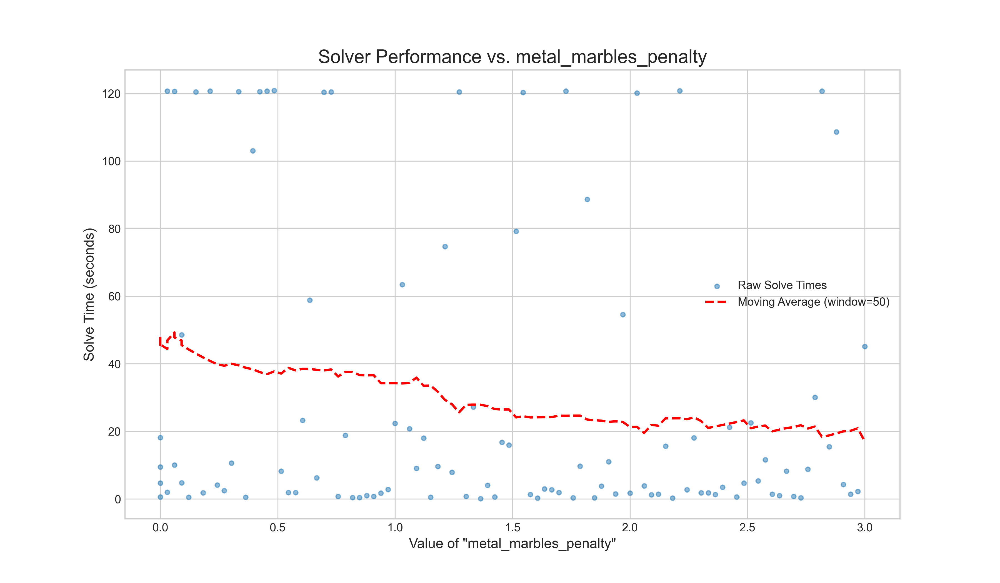
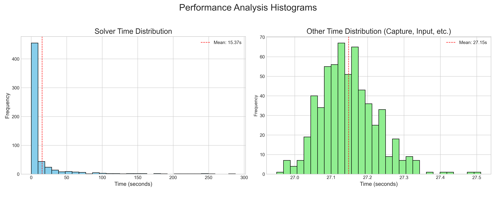
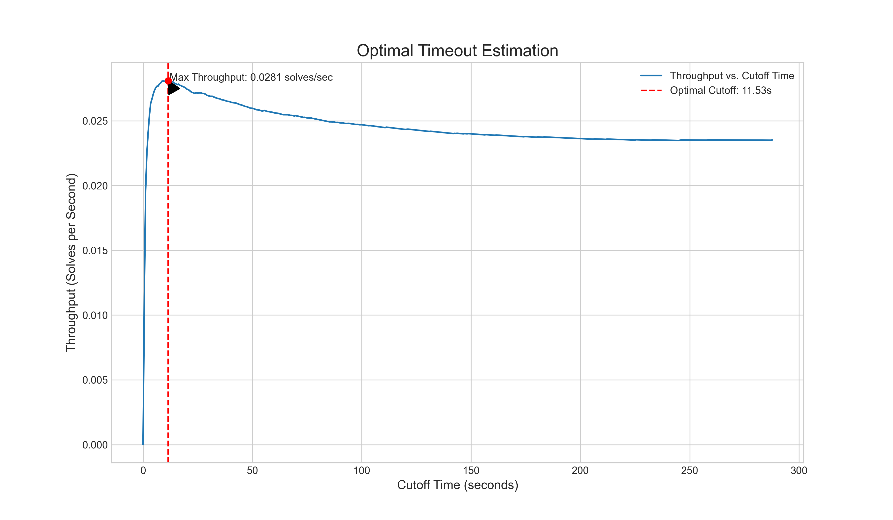

# 附录


## 1. 启发式函数调参

A* 求解器的核心在于其启发式函数 (`h_cost`)，它评估了当前棋盘状态的“优劣”。通过调整其权重，可以显著改变求解器的行为和效率。

### a. 权重参数说明

这些参数位于 `config/solver_config.json` 中：

-   `remaining_elements_factor`: 剩余元素数量的权重。这是最基础的评估，值越高，求解器越倾向于快速消除任何元素。
-   `locked_marbles_penalty`: 被锁定（无法消除）的元素的惩罚权重。值越高，求解器会越优先尝试解锁这些元素。
-   `salt_marbles_reward`: “盐”元素的奖励权重。因为盐是万能配对元素，保留它可以增加后续的灵活性。这是一个负向惩罚（即奖励），值越高，求解器越倾向于保留盐。
-   `metal_marbles_penalty`: 金属元素的惩罚权重。因为金属元素配对规则复杂（必须按顺序消除），所以给予高惩罚可以优先消除金属。

### b. 如何使用动态调参工具

`tools/dynamic_tuner.py` 是一个用于自动测试和评估上述参数的工具。

**示例**: 测试 `metal_marbles_penalty` 参数，范围从 1.0 到 2.0，分 50 步，每个值测试 5 个谜题：
    ```bash
    python tools/dynamic_tuner.py tune --param metal_marbles_penalty --start 1.0 --end 2.0 --steps 50 --puzzles 5
    ```
    -   `--param`: 要调整的参数名（必须与配置文件中的键名一致）。
    -   `--start`, `--end`: 测试范围的起始值和结束值。
    -   `--steps`: 在该范围内取多少个测试点。
    -   `--puzzles`: 每个参数值要跑多少个谜题来取样。

    工具会自动运行游戏，记录每次成功求解的时间，并将数据保存在 `assets/analysis/[param_name]/time.csv`。

3.  **运行绘图模式**: 测试完成后，使用 `plot` 子命令来可视化结果。

    **示例**: 绘制 `metal_marbles_penalty` 的性能图：
    ```bash
    python tools/dynamic_tuner.py plot --param metal_marbles_penalty
    ```
    -   `--window`: (可选) 移动平均线的窗口大小，用于平滑曲线。

    该命令会读取对应的 `time.csv` 文件，并生成一张散点图和移动平均曲线图，保存为 `assets/analysis/[param_name]/[param_name]_performance_plot.png`。通过观察曲线的波谷，你可以找到该参数的最优值。

### c. 调参实例分析

下图是使用动态调参工具对 `metal_marbles_penalty` 参数进行测试后生成的一个性能分析图。



可根据此图调节参数

## 2. 中断条件估计 (Interrupt Condition Estimation)

为了最大化单位时间内的解题效率，我们需要一个合理的超时机制：在某个谜题上花费过多时间是不划算的，主动放弃并开始下一个可能更优。`tools/performance_analyzer.py` 工具就是为此设计的。

### a. 收集性能数据

首先，使用 `run` 模式来收集基准性能数据。该工具会多次运行解谜循环，并记录下每次成功解谜的“求解器时间”和“其他时间”（如截图、点击等）。

```bash
python tools/performance_analyzer.py run --runs 100
```
数据会保存在 `assets/analysis/total/performance.csv`。运行的次数越多，后续的估算越准确。

### b. 分析性能分布

收集数据后，可以使用 `plot` 模式来可视化性能数据。

```bash
python tools/performance_analyzer.py plot
```
这会生成一张包含两个直方图的图像，保存在 `assets/analysis/total/performance_histogram.png`。



*   **左图 (Solver Time Distribution)**: 显示了求解器成功找到解法所需时间的分布。
*   **右图 (Other Time Distribution)**: 显示了除求解器计算之外的其他固定开销（如截图、分析、点击、等待加载等）的时间分布。

### c. 估算最优超时

。使用 `estimate` 模式，工具会根据历史数据，计算出能最大化“每小时解题数”的最佳超时时间。

```bash
python tools/performance_analyzer.py estimate --plot
```

该命令会输出详细的分析过程和结果，并生成一张吞吐率分析图，保存在 `assets/analysis/total/optimal_timeout_plot.png`。



根据上图分析，横轴代表我们设定的“超时时间”，纵轴代表对应的“吞吐率”（每秒解题数）。曲线的峰值就是我们的最优点。从图中可以看出，将超时时间设置在 **11.5秒** 左右时，我们可以达到最高的解题效率，大约每小时能解决101个谜题。将这个值设置为 `interrupt_config.json` 中的超时条件，即可实现最大化的自动化效率。

由于硬件存在差异，可以自行运行来估计最佳中断条件。


## 3. 谜题数据集收集器 (Puzzle Collector)

`tools/puzzle_collector.py` 是一个自动化工具，用于大规模收集和分类谜题数据。它的主要目的是建立一个多样化的谜题数据集，覆盖从易到难的各种情况，为求解器性能分析和优化提供基础。

### a. 工作流程

该工具会自动执行以下循环：

1.  **启动新游戏**: 模拟点击游戏内的“开始新游戏”按钮。
2.  **捕捉与分析**: 等待新谜题加载后，捕捉棋盘状态。
3.  **求解**: 调用A*求解器尝试解决当前谜题。
4.  **分类与保存**:
    -   如果找到解法，根据求解所需的时间，将谜题（包括初始状态和解法路径）保存到对应的分类目录中（如 `0-1s`, `1-10s` 等）。
    -   如果在设定的超时时间内未找到解法，则将其保存到 `noanswer` 目录中。
5.  **重复**: 循环执行以上步骤，直到每个分类下的谜题数量达到预设的目标。

### b. 如何使用

直接从项目根目录运行脚本即可：

```bash
python tools/puzzle_collector.py
```

-   脚本启动后，它会接管鼠标，自动在游戏窗口中进行操作。
-   收集过程的状态会实时显示在游戏窗口上方的覆盖层中，你可以看到每个分类已收集的数量。

### c. 配置文件与目录结构

-   **分类配置**: 谜题的时间分类、每个分类的目标数量等都在 `PuzzleCollector` 类的 `__init__` 方法中定义。你可以根据需要修改这些配置。
-   **输出目录**: 所有收集到的谜题都保存在 `assets/collected_puzzles/` 目录下，并按求解时间分门别类。

这个工具对于评估求解器在不同难度谜题上的表现、发现求解器的弱点以及为启发式函数调优提供测试用例集至关重要。


## 4. 求解过程可视化器 (Solver Visualizer)

`tools/solver_visualizer.py` 是一个强大的诊断工具，用于将A*求解器的搜索过程可视化。它通过将求解器探索的每一个节点（即一个棋盘状态）和它们之间的关系绘制成一张巨大的树状图，来帮助开发者理解算法的行为。

### a. 功能与目的

-   **理解算法行为**: 通过观察搜索树的形状、广度和深度，可以直观地了解启发式函数是如何引导搜索方向的。
-   **调试疑难杂症**: 对于那些求解时间极长或无法求解的谜题，可视化其搜索过程可以帮助定位问题所在（例如，是否陷入了某个局部最优解区域）。
-   **性能分析**: 图像的整体“宽度”和“颜色分布”可以反映出求解的效率。一个高效的求解过程通常会呈现出一棵相对“窄”且颜色（代表f_cost）变化平稳的树。

### b. 如何使用

该工具通过命令行接收一个已保存的谜题 `.json` 文件作为输入，然后重新运行求解器并生成可视化图像。

```bash
python tools/solver_visualizer.py path/to/your/puzzle.json
```

-   运行结束后，会在项目根目录下生成一张名为 `visualization_puzzle_...png` 的图像文件。
-   由于生成的图像可能非常巨大（几十万甚至几百万像素的宽度），工具还会贴心地生成一张 `_preview.png` 后缀的缩略图，方便快速查看。

### c. 可视化图像解读


-   **节点 (Node)**: 图中的每个点代表求解器探索过的一个棋盘状态。
-   **边 (Edge)**: 连接节点的线代表状态之间的转换（即一次消除操作）。
-   **颜色**:
    -   节点的颜色基于其 f_cost (g_cost + h_cost) 使用Viridis 色谱进行映射。通常，颜色从蓝色（低f_cost）渐变到黄色（高f_cost）。
    -   **绿色节点** 是初始状态。
    -   **亮红色/橙色路径** 是最终找到的解法路径。
-   **布局**:
    -   **Y轴** 代表深度（g_cost），即到达该状态所需的步数。
    -   **X轴** 用于在同一深度层级上展开节点，避免重叠。

通过分析这张图，我们可以清晰地看到求解器从起点开始，是如何一步步扩展搜索空间，并最终找到通往终点（已解决状态）的最优路径的。
