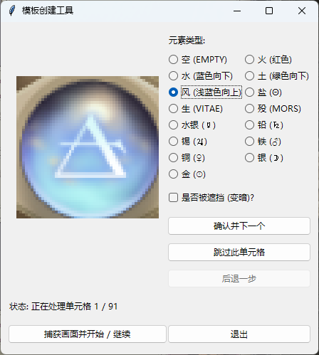

# 用户指南

本指南提供了 Opus Magnum Bot 的详细使用说明，包括命令行、配置和故障排查。

## 1. 命令行参数

脚本通过命令行参数来控制其运行模式。

-   `python main.py`
    不带任何参数运行时，脚本将执行一次解谜循环。

-   `python main.py -c` 或 `--continuous`
    使用 `-c` 参数，脚本将进入无限连续运行模式。它会一直解谜，直到你手动停止程序（例如，在命令行窗口按 `Ctrl+C`）。

-   `python main.py -c N`
    在 `-c` 参数后跟一个数字 `N`，脚本将连续运行 `N` 次。

## 2. 配置文件详解

所有配置文件均为 JSON 格式，位于 `config/` 目录下。在修改前，建议先将 `.json.example` 文件复制一份。

### `config/grid_config.json`

该文件定义了脚本与游戏棋盘的几何对应关系。

-   `grid_radius`: 从中心六边形到最外层六边形的层数（不包含中心）。对于标准棋盘，这个值通常是 54`。
-   `sampling_radius_ratio`: 一个比例系数，用于确定从每个六边形中心点采样多大范围的圆形区域来识别元素。默认值 `0.7` 表示采样半径为六边形内切圆半径的一半。
-   `anchor_points`: 这是配置中最关键的部分，它定义了整个网格的坐标系。
    -   `left_most_hex_center`: 棋盘水平中轴线上，最左侧那个六边形中心的 **窗口相对坐标** (x, y)。
    -   `right_most_hex_center`: 棋盘水平中轴线上，最右侧那个六边形中心的 **窗口相对坐标** (x, y)。
    脚本会根据这两个锚点和 `grid_radius` 自动计算出所有六边形的精确位置。
-   `ui_points`: 定义了关键UI元素的 **窗口相对坐标**。
    -   `start_new_game_button`: “开始新游戏”按钮的中心坐标，用于在连续模式下自动开始下一局。

### `config/solver_config.json`

此文件控制 A* 解谜算法的核心——启发式函数 (`h_cost`) 的行为。调整这些权重可以改变求解器的决策偏好。

-   `heuristic_weights`:
    -   `remaining_elements_factor`: **剩余元素因子**。这是启发式函数的基础，代表消除一个元素能降低多少“成本”。
    -   `locked_marbles_penalty`: **锁定元素惩罚**。棋盘上每个被锁定（周围没有三个连续空格）的元素都会增加该值的惩罚。值越高，求解器越倾向于优先解锁被困住的元素。
    -   `salt_marbles_reward`: **盐元素奖励**。这是一个“负向惩罚”。因为盐可以和任何基础元素配对，保留它可以增加后续解法的灵活性。值越高，求解器越倾向于将盐留到最后使用。
    -   `metal_marbles_penalty`: **金属元素惩罚**。因为金属元素必须按特定顺序（铅 -> 锡 -> ...）消除，所以它们是解谜的难点。给予一个高的惩罚值，使求解器优先解锁金属元素。

### `config/interrupt_config.json`

用于配置求解器的安全中断机制，以防止在遇到无解或过于复杂的棋盘时陷入无限搜索。

-   `enabled`: `true` 或 `false`，决定是否启用中断机制。
-   `condition_set`: 一个定义了中断规则的逻辑块。
    -   `logic`: 可以是 `AND` 或 `OR`，决定其内部 `conditions` 列表的组合方式。
    -   `conditions`: 一个条件列表。每个条件可以是另一个 `condition_set`（用于实现嵌套逻辑），也可以是一个具体的判断规则。
        -   `variable`: 要监控的实时变量，可选值包括：
            -   `"iteration"`: A* 算法的迭代次数。
            -   `"open_set_size"`: A* 算法中“开放列表”的大小，代表待探索的状态数。
            -   `"best_g_cost"`: 当前找到的最优路径的长度（步数）。
            -   `"elapsed_time"`: 求解器已运行的时间（秒）。
        -   `operator`: 比较操作符，如 `>`、`<`、`==` 等。
        -   `value`: 用于比较的阈值。

## 3. 生成自定义模板

若默认的元素识别不准（例如，因特殊分辨率或显示设置），可使用 `tools/create_templates.py` 工具生成一套完全适配当前环境的模板。

### 使用流程

1.  **启动**: 运行 `python tools/create_templates.py` 启动图形化工具。
2.  **准备**: 打开游戏，进入一个包含多种元素的谜题。
3.  **捕获**: 在工具中点击“捕获画面”按钮，程序会自动截图并分析棋盘。
4.  **标记**:
    -   工具左侧会显示棋盘上第一个六边形的图像。
    -   在右侧选择该图像对应的正确元素，并指明其是否“变暗”（被遮挡）。
    -   点击“确认并下一个”，工具会自动保存该模板并跳转到下一个六边形。
5.  **操作**:
    -   **跳过**: 跳过当前不想标记的六边形。
    -   **后退**: 撤销上一步的标记操作。
    -   **继续捕获**: 完成一屏后，可在游戏中进入新谜题，然后再次点击“捕获画面”按钮继续标记。
6.  **完成**: 关闭窗口即可。新生成的模板保存在 `assets/templates/` 目录下，程序下次运行时会自动加载。

